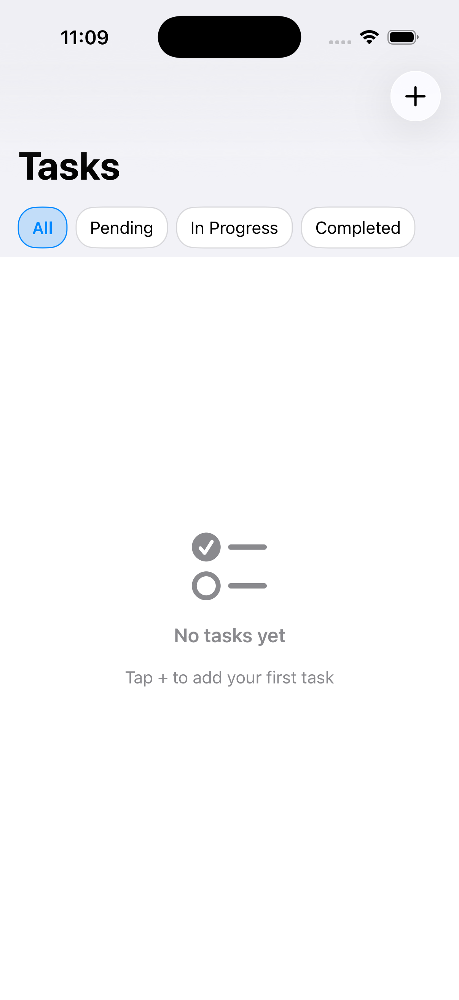
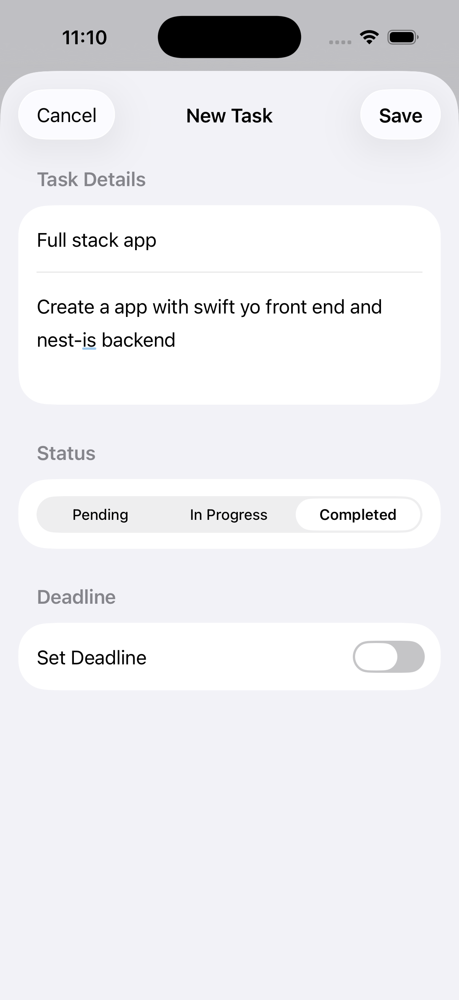
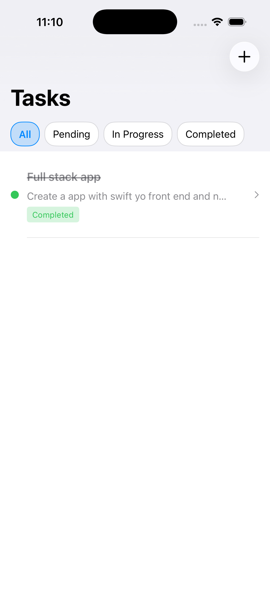

# Task Management - Full Stack Application

A full-stack task management application featuring a **NestJS REST API backend** with a native **SwiftUI iOS client**. This project demonstrates end-to-end application development from database design to mobile UI.

<p align="center">
  
  
  
</p>

---

## Tech Stack

### Backend
| Technology | Purpose |
|------------|---------|
| **NestJS v11** | Node.js framework with TypeScript |
| **TypeORM** | Object-Relational Mapping |
| **PostgreSQL** | Relational database |
| **class-validator** | Request validation & DTO enforcement |
| **Jest** | Unit & E2E testing framework |

### Frontend
| Technology | Purpose |
|------------|---------|
| **SwiftUI** | Declarative UI framework |
| **Swift 5** | iOS development language |
| **MVVM** | Architecture pattern |
| **URLSession** | Network layer |

---

## Backend Architecture

### Project Structure
```
my-backend/
├── src/
│   ├── main.ts                 # Bootstrap with ValidationPipe
│   ├── app.module.ts           # Root module + TypeORM config
│   ├── tasks/
│   │   ├── tasks.module.ts     # Feature module
│   │   ├── tasks.controller.ts # REST endpoints
│   │   ├── tasks.service.ts    # Business logic
│   │   ├── entities/
│   │   │   └── task.entity.ts  # Database model
│   │   └── dto/
│   │       ├── create-task.dto.ts
│   │       └── update-task.dto.ts
│   └── users/
│       └── ... (same structure)
└── test/                       # E2E tests
```

### API Endpoints

#### Tasks
| Method | Endpoint | Description |
|--------|----------|-------------|
| `GET` | `/tasks` | Retrieve all tasks |
| `GET` | `/tasks/:id` | Retrieve task by ID |
| `POST` | `/tasks` | Create new task |
| `PATCH` | `/tasks/:id` | Update existing task |
| `DELETE` | `/tasks/:id` | Delete task |

#### Users
| Method | Endpoint | Description |
|--------|----------|-------------|
| `GET` | `/users` | Retrieve all users |
| `GET` | `/users/:id` | Retrieve user by ID |
| `POST` | `/users` | Create new user |

### Database Schema

**Task Entity**
| Column | Type | Constraints |
|--------|------|-------------|
| `id` | int | Primary Key, Auto-increment |
| `name` | varchar | NOT NULL |
| `description` | text | NULLABLE |
| `status` | enum | PENDING, IN_PROGRESS, COMPLETED |
| `deadline` | timestamp | NULLABLE |
| `createdAt` | timestamp | Auto-generated |
| `updatedAt` | timestamp | Auto-updated |

**User Entity**
| Column | Type | Constraints |
|--------|------|-------------|
| `id` | int | Primary Key, Auto-increment |
| `name` | varchar | NOT NULL |
| `email` | varchar | NOT NULL |

### Request Validation

DTOs with class-validator ensure type safety:

```typescript
// create-task.dto.ts
export class CreateTaskDto {
  @IsString()
  @IsNotEmpty()
  name: string;

  @IsString()
  @IsOptional()
  description?: string;

  @IsEnum(TaskStatus)
  @IsOptional()
  status?: TaskStatus;

  @IsDateString()
  @IsOptional()
  deadline?: string;
}
```

### API Request Examples

**Create Task**
```bash
curl -X POST http://localhost:3000/tasks \
  -H "Content-Type: application/json" \
  -d '{
    "name": "Complete project",
    "description": "Finish the backend API",
    "status": "PENDING",
    "deadline": "2025-02-01T00:00:00.000Z"
  }'
```

**Response**
```json
{
  "id": 1,
  "name": "Complete project",
  "description": "Finish the backend API",
  "status": "PENDING",
  "deadline": "2025-02-01T00:00:00.000Z",
  "createdAt": "2025-01-15T10:30:00.000Z",
  "updatedAt": "2025-01-15T10:30:00.000Z"
}
```

---

## iOS Client Architecture

### Project Structure
```
tasks/
├── Models/
│   └── Task.swift           # Data model matching backend
├── ViewModels/
│   └── TasksViewModel.swift # State management & API calls
├── Views/
│   ├── TaskListView.swift   # Main list with status filters
│   ├── TaskRowView.swift    # Individual task cell
│   ├── AddTaskView.swift    # Create task form
│   └── EditTaskView.swift   # Edit task form
└── Services/
    └── APIService.swift     # Network layer
```

### Features
- Status filtering (All, Pending, In Progress, Completed)
- Create, edit, and delete tasks
- Optional deadline with date picker
- Real-time sync with backend API
- Clean, native iOS design

---

## Getting Started

### Prerequisites
- Node.js 18+
- PostgreSQL 14+
- Xcode 15+ (for iOS client)

### Backend Setup

```bash
cd my-backend

# Install dependencies
npm install

# Configure environment
cp .env.example .env
# Edit .env with your database credentials

# Create database
createdb tasks_db

# Run in development mode
npm run start:dev
```

API available at `http://localhost:3000`

### iOS Setup

1. Open `swift-nest-e-commerce/tasks/tasks.xcodeproj` in Xcode
2. Update API base URL in `Services/APIService.swift` if needed
3. Build and run on simulator or device

---

## Available Scripts

### Backend
| Command | Description |
|---------|-------------|
| `npm run start:dev` | Development with hot reload |
| `npm run build` | Compile TypeScript |
| `npm run start:prod` | Production mode |
| `npm run test` | Run unit tests |
| `npm run test:e2e` | Run E2E tests |
| `npm run lint` | ESLint check |

---

## Project Highlights

**Backend**
- Modular NestJS architecture with feature modules
- TypeORM for database abstraction and migrations
- DTO pattern with class-validator for request validation
- Global ValidationPipe with transform enabled
- Environment-based configuration
- Comprehensive error handling with proper HTTP status codes

**Frontend**
- MVVM architecture for separation of concerns
- SwiftUI for declarative, reactive UI
- Async/await for clean network code
- Status-based task filtering
- Form validation before submission

---

## License

MIT
